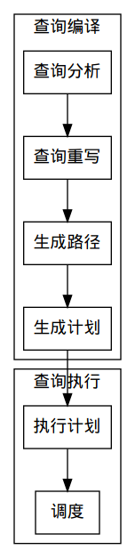

# PostgreSQL模块解析

​	PostgreSQL模块下主要有初始化、SQL引擎、存储模块、锁模块、日志模块组成。由于初始化在开发过程中一般不会更改，所以初始化模块过程本文不会提及，读者可自行查阅。

## 一、SQL引擎

​	SQL引擎是数据库的核心组件，包括查询编译和查询执行，查询编译包括查询分析、查询重写、查询优化，如下图所示。



​	显然，一套查询流程中每个模块只需要负责接收前一个模块的结果和计算下一个模块所需的结果，这样就保证了我们在对其中一个或几个模块时对其它模块透明。

​	在接下来讨论之前，有几个名词需要定义一下：

- **command type**：产生查询树打命令，如SELECT、INSERT、DELETE、UPDATE等。
- **range table**：查询用到的所有表。
- **result relation**：查询结果所返回的表，用range table内的序号来指向结果表。SELECT语句没有结果表。
- **target list**：表示查询目标的序列。
- **qualification**：限定查询结果的表达式。
- **join tree**：表的组织形式。这是将表组织起来，产生最终要访问表的形式，通常为树状形式，如果对于无join连接的语句如SELECT ... FROM a, b，产生的join tree为a，b这个list。

#### 查询分析

​	查询分析主要做的是将SQL命令转换为Query结构的查询树。这部分主要是编译原理的内容，就不再详述。

#### 查询重写

​	rewrite system是PostgreSQL根据已有的规则来对一颗查询树进行重写，最终输出的也是查询树。这些规则存储在pg_rewrite系统表中。

​	重写系统实际上是将对某个表的某种查询语句进行重载，达到目标效果。最常用的重写是视图。例如：

```sql
CREATE VIEW a AS SELECT * FROM table;
```

​	实际上是将被重写为：

```sql
CREATE TABLE a (same column list as table);
CREATE RULE "_RETURN" AS ON SELECT TO table DO INSTEAD 			SELECT * FROM table;
```

​	通过这种方式可以生成一些简单的批量操作或者其他功能。

#### 生成路径/生成计划

​	这一模块将一个Query结构的查询树转换成执行路径较优（根据耗时、索引方式比较）的执行路径。

​	路径生成主要是对于join tree的组织，通过计算所有表组成的所有的join tree形式，再分别算出各个树的运行时间等来选择一颗运行时间较低的树作为最终的生成路径。有时连接的表数量较多，如果计算出所有可能路径会占用大量的内存和花费大量的时间，这个时候PostgreSQL会选择遗传算法来选择较优的路径，一般表的数量超过12时会选择遗传算法。

#### 执行器

​	执行器获得产生的最优路径后，递归的按照路径来执行，并且每次返回一行数据。

## 二、存储模块

​	存储模块分为内存管理和外存管理。内存管理涉及本地内存管理、共享内存管理；外存管理涉及存储管理、空闲空间管理和回收机制。

#### 内存管理

###### 1.内存上下文

​	内存管理里面最重要的概念就是**内存上下文**（MemoryContext）。内存上下文其实就是一种记录已经分配内存的树结构，每次分配和释放内存时都会把使用的内存块放在该树的一个结点内。创建多个内存上下文可以满足不同的需要，比如Cache内存上下文、错误内存上下文等。PostgreSQL内存中所有的功能部件（除了共享内存）都由内存上下文分配/回收空间。

​	内存上下文对外只暴露三个接口：palloc、realloc、pfree。这三个函数的使用和系统调用一样，使得内存上下文本身对调用函数透明。

	###### 2.Cache

​	Cache也是缓冲区的一部分，和操作系统的Cache的位置不一样，PostgreSQL的Cache处于内存中。

​	Cache的设置是为了满足频繁对表的模式信息访问，避免这些信息在读入大量数据时被替换出去而设置。同样，这一层只在表被打开查询时使用，对调用者透明。

###### 3.缓冲区管理

​	缓冲区分为本地缓冲区和共享缓冲区。共享缓冲区存放一般的表数据，数据库内的表的数据都放在这个地方；而本地缓冲区主要是存放查询过程中的临时表和数据。

​	缓冲区分配先分配空闲缓冲区块，没有空闲块时使用LRU算法进行替换。

#### 外存管理

​	外存管理主要负责和存储介质交互的过程，现阶段PostgreSQL存储管理器只支持磁盘介质管理器。外存的数据存储格式很简单，就不在这里介绍了。下面简单说明一下对于外存管理的常见机制。

###### 1.VFD

​	PostgreSQL通过VFD机制规避了操作系统打开文件数量的限制，原理和虚拟内存相似。

###### 2.FSM

​	空闲空间的管理通过FSM文件来记录，实质上是通过一种只有三层的堆结构来记录所有的空闲空间，每个堆内部节点的值记录的是子节点的最大值，这样就可以很快判断出新数据是否能够放入空闲空间中。

###### 3.VM

​	PostgreSQL删除数据时不是直接物理删除，而是将该数据进行标记，统一等到VACUUM进程来进行清理。

​	这样做的好处有两个好处，一是避免大量的I/O操作，二是为实现多版本并发控制。

###### 4.大数据

​	略。

## 三、锁模块

​	锁模块（这个名字是我自己编的）不是一个独立的模块，而是穿插在SQL引擎和存储模块内部，主要解决了并发事务的竞争。

​	PostgreSQL提供两种隔离级别：读已提交、可串行化。

​	在PostgreSQL中通过锁管理来控制对不同的对象的锁控制，包括表、内存页、元组、事务等，来达到不同程度的并行控制。

## 四、日志模块

​	日志模块和PostgreSQL内部所有模块都有耦合，但同时日志模块只接收信息，不对其它功能有影响，所以日志模块的独立性也是所有模块最高的。

​	一般也没人会对日志模块进行更改吧(●'◡'●)，这里只介绍一下各种日志类型及功能。

- CLOG日志：记录事务的最终状态。
- SUBTRANS日志：在嵌套事务中记录父事务的ID。
- MULTIXACT日志：记录组合事务ID。
- XLOG日志：记录进程对数据库的操作过程。


## 参考资料

-  [彭智勇, PostgreSQL 数据库内核分析](http://www.amazon.cn/PostgreSQL-数据库内核分析-彭智勇/dp/B006BNJNBC) 
- [PostgreSQL官方文档](https://www.postgresql.org/docs/)